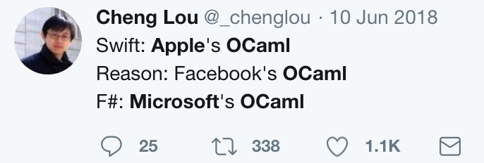

## 官网

代码库：https://github.com/rescript-lang

官网：	https://rescript-lang.org/

​			   https://rescript-lang.org.cn/

官方文档: 	https://github.com/rescript-association/rescript-lang.org

新的语法代码库：https://github.com/rescript-lang/syntax

社区： https://github.com/rescript-association

​			https://rescript-association.org/

社区论坛：https://forum.rescript-lang.org/

张宏波，ReScript编程语言作者，前OCaml程序语言的唯一中国核心开发人员。本科毕业于清华大学电子工程系，硕士毕业于宾夕法尼亚大学计算机系，现任Facebook在华特聘软件工程师。

## 参考

漫谈函数式编程：聊聊 OCaml

https://blog.csdn.net/valada/article/details/94420642

面向对象编程是计算机科学的最大错误：

https://mp.weixin.qq.com/s/xHf2oBx8LyfrfY2RoHuRBg

Reason网站：

https://reasonml.github.io/zh-CN/

作者在知乎上的介绍:

https://zhuanlan.zhihu.com/p/22216448

ReasonML + BuckleScript = ReScript

ocaml类型系统+js语法=ReScript！

BuckleScript （将 OCaml 编译为 JavaScript）和 Reason（为 OCaml 提供了更接近 C 系语言的语法）这两个项目宣布合并为 [ReScript 语言](https://rescript-lang.org/)。整合后能够支持更多原本难以支持的语言特性。目前而言，相比 Reason，ReScript 的语法更接近 JavaScript，特异之处更少

ocaml:

https://github.com/ocaml

知乎上的评价:

https://www.zhihu.com/question/415293347

Reason  BuckleScript 发布了更接近 JS 的新语法:

https://zhuanlan.zhihu.com/p/153182416

https://www.zhihu.com/question/347763134/answer/840238084

2020年8月才合并:

https://rescript-lang.org/blog/bucklescript-is-rebranding

reason的中文文档:

https://reasonml.github.io/docs/zh-CN/what-and-why

作者的知乎上的自我介绍:

https://www.zhihu.com/question/359906573/answer/1709942996

作者介绍rescript vs ts

https://zhuanlan.zhihu.com/p/22216448

不错的推文:

https://medium.com/att-israel/how-i-switched-from-typescript-to-rescript-637aa5ef8d3

